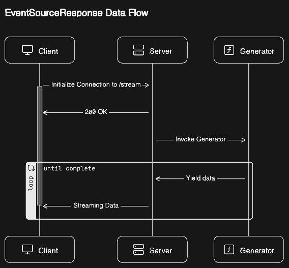

<article class="prose prose-slate dark:prose-invert">
    # Server-Sent Events: How to Build a Chat App with Streaming Response like ChatGPT

    ## Introduction: What are Server-Sent Events (SSE)?
    
    Imagine if a web page could subscribe to data from the server, all it had to do was establish connection to a certain endpoint, any updates from the server would be received via the connecton and the client could handle accordingly.
    
    This is what [SSE](https://developer.mozilla.org/en-US/docs/Web/API/Server-sent_events) allows, A uni-directional client-server connection where the server can push data (Events) to the client as it chooses. This is in contrast to the regular client-server connections wherein the client has to send a request first to recieve response from the server.

    Applications that utilize this type of response are Chat Apps (eg: [chat.openai.com](https://chat.openai.com)), Stock Price Trackers etc.

    ## Components of the app
    
    1. A Server that can send SSE.
    2. A Vanilla Js client that will use the native EventSource API to 1. Establish the SSE Connection & 2. Handle incomming events

    Let's build!

    ### The Server:

    We'll need a simple API server that has the capability to send SSE. For this demo, we'll be [FastAPI](https://fastapi.tiangolo.com/#installation). While FastAPI doesn't have any built-ins for SSE, the asgi server it's based on: [starlette](https://www.starlette.io/) does, so we'll also need [sse_starlette](https://github.com/sysid/sse-starlette).

    #### Setup

    ```bash
    mkdir server
    cd server
    poetry init -y
    poetry shell
    poetry install fastapi uvicorn["standard"] sse-starlette
    ```

    #### Code

    Let's start with the basics

    ```python
    app.py

    from fastapi import FastAPI
    from fastapi.responses import Response

    app = FastAPI()

    @app.get("/")
    def root():
        return Response("Hello World")
    ```

    We'll be using the `EventSourceResponse` class from sse_starlette. It's usage is simple, we provide an async generator to the content attribute. The response object first returns 200 and then invokes the generator, any value yeilded by the generator is streamed back to the client as Server-Sent Events. Here is a simple sequence chart:

    

    Let's build the async generator, for this app, the generator will simply yeild characters from a given string pausing for 0.05 seconds b/w each yeild. You can replace this with anything you like. Some examples: streaming response from llms like OpenAI, streaming html snippets etc.

    ```python
    app.py

    ...

    # A global variable to store the client message that'll be 
    # streamed back
    streamable_str = ""

    async def mock_async_generator():
        global streamable_str
        for c in streamable_str:
            yield c
            await asyncio.sleep(0.05)
        streamable_str = ""
    ```

    Next, the sse endpoint.

    ```python
    app.py

    from sse_starlette import EventSourceResponse

    ...

    @app.get("/stream")
    def get_stream():
        if streamable_str:
            return EventSourceResponse(content=mock_async_generator())
        return EventSourceResponse(content=iter(()))
    ```

    #### Let's test it out

    Update the `streamable_str` variable to hold some text:

    ```python
    app.py

    ...

    streamable_str = "Hello World"

    ...
    ```

    ```bash
    uvicorn app:app --reload
    ```

    Open up yout browser and open up http://localhost:8000/stream, you should be able to see "Hello World" being streamed characted by character. Great! We now have a basic server that sends SSE Response. Let's work on the front end now.

    ### The Client:

    We'll be using vite to setup a vanilla js frontend.

    #### Setup

    ```bash
    npm create vite@latest client -- --template vanilla
    ```

    #### Code

    Let's setup basic markup to render a basic chat app which contains an input to collect user message & a container to view the chat messages.

    ```html
    <!doctype html>
    <html lang="en">
    <head>
        <meta charset="UTF-8" />
        <link rel="icon" type="image/svg+xml" href="/vite.svg" />
        <meta name="viewport" content="width=device-width, initial-scale=1.0" />
        <title>Vite App</title>
    </head>
    <body>
        <main>
            <section class="chatWindow">
                <div class="chatLogWrapper">
                    <!-- The messages will be <li> elements inside this list -->
                    <ul class="chatLog"></ul>
                </div>
                <div class="chatInput">
                    <form method="POST" id="chatInputForm">
                        <input type="text" name="userMessage" id="userMessage" placeholder="Enter your message" required>
                        <button type="submit" id="sendMessageBtn">Send</button>
                    </form>
                </div>
            </section>
        </main>
        <script type="module" src="/main.js"></script>
    </body>
    </html>
    ```

    Next, Sending of user messages. This part is self explanatory, we simply:

    3. Get user message from form submission.
    4. Create a `li` element with the user message and add to the chatLog `ul`
    5. Send the user message to the server.
    6. If response is 200, create a corresponding `ul` chatelement to which the sse events will be streamed and rendered to.


    ```javascript
    main.js

    let msgId;

    const formEl = document.getElementById("chatInputForm");
    const chatLogEl = document.getElementsByClassName("chatLog")[0];

    formEl.addEventListener("submit", async function(e) {
        e.preventDefault()

        const formData = new FormData(e.target)
        const userMessage = formData.get("userMessage");
        controlFormState(true)

        msgId = createMessageIdPair();
        const userMessageEl = createChatMessageEl(msgId.userMsgId)
        userMessageEl.innerHTML = userMessage;
        chatLogEl.appendChild(userMessageEl);

        const result = await fetch('http://127.0.0.1:8000/stream', {
            method: 'POST',
            headers: {
                'Accept': 'text/event-stream',
                'Content-Type': 'application/json'
            },
            body: JSON.stringify({message: userMessage})
        })
        if (result.ok) {
            const aiResponseEl = createChatMessageEl(msgId.aiMsgId, true);
            chatLogEl.appendChild(aiResponseEl);
        }
    })
    ```

    Now, handling the streaming response received from the server.

    ```javascript
    main.js

    const eventSource = new EventSource('http://127.0.0.1:8000/stream')

    eventSource.addEventListener("message", (event) => {
        const aiResponseEl = document.getElementById(msgId.aiMsgId);
        aiResponseEl.style = ''
        aiResponseEl.innerHTML += `${event.data}`
    })

    eventSource.addEventListener("end", (event) => {
        controlFormState()
    })
    ```

    We're complete with both the Client and Server, let's use our chat app. Spin up both if not already

    ```bash
    npm run dev
    ```

    ```bash
    uvicorn app:app --reload
    ```

    Head over to the client at http://localhost:5173 and type and send a message, you should get the same message streamed back.

    ## Closing thoughts

    Learning and implementing SSE has been fun, it all started when I observed how chat GPT got it done.

    Keep building!

    <br></br>
</article>