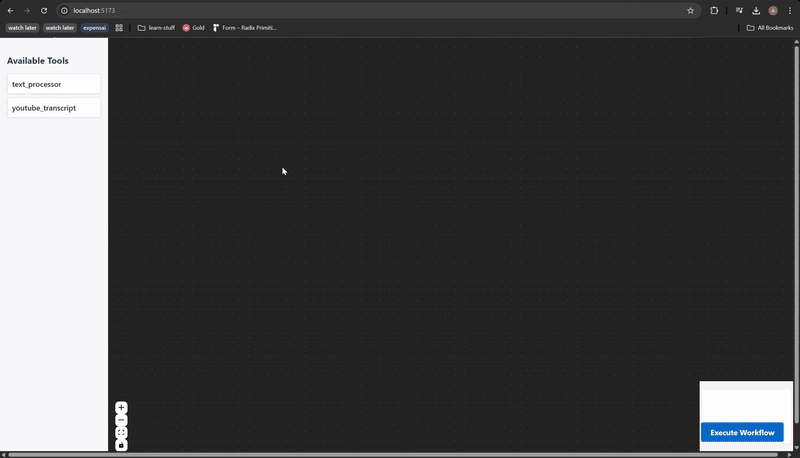

<article class="prose prose-stone dark:prose-invert">
    # 2 Hours to Build a Workflow-Based Automation MVP Tool – Welcome to the New Era of AI Agentic IDEs

    

        <h3 id="contents" class="font-bold text-xl pb-3">Contents</h3>
        1. [My Journey into AI-Powered Coding](#my-journey-into-ai-powered-coding)
        2. [The Experiment: A side project purely written by AI](#the-experiment-a-side-project-purely-written-by-ai)
        3. [Key Learnings from My AI IDE Experiment](#key-learnings-from-my-ai-ide-experiment)
        3. [AI IDEs: The Future of MVP Development?](#ai-ides-the-future-of-mvp-development)
        3. [Final Thoughts](#final-thoughts)
    

    ## My Journey into AI-Powered Coding

    As a software developer, I initially dipped my toes into AI-assisted coding with tools like Co-Pilot. It was helpful, but I quickly realized I was losing touch with actual coding. Plus, my lack of experience with prompt engineering meant the AI’s output was often suboptimal. And let’s be honest—fixing AI-generated code can sometimes be just as frustrating as debugging someone else’s messy work. So, I decided to step back and rely on my own skills while keeping an eye on the evolution of AI tools.

    That’s when AI Agentic IDEs caught my attention. Tools like [Cursor](https://www.cursor.com/), [Bolt](https://bolt.new/) and [Windsurf](https://codeium.com/windsurf) intrigued me—could an IDE really build an entire software from just instructions?

    ## The Experiment: A side project purely written by AI

    I was working on a side project and thought, "Why not try these new Agentic IDEs?" Since I had already done my research and had a solid understanding of the backend design, I figured it was the perfect scenario. I chose [Windsurf](https://codeium.com/windsurf) as my AI-native IDE and set out to build a fully functional workflow tool. (I probably won't stick with Windsurf due to pricing, more details in the end)

    The result? A working backend in about 1.5 to 2 hours—with minimal manual coding. That’s when it hit me: this is the future. But, of course, not without its quirks and lessons.

    Demo:
    

    ## Key Learnings from My AI IDE Experiment

    ### 1. Instructions, Instructions, Instructions

    The quality of AI output depends entirely on the quality of the instructions you provide. This means:

    1. You need to be crystal clear about what you want.

    2. Understanding the technical specifics—code architecture, components, table design, etc.—is crucial.

    3. AI tools like ChatGPT can assist, but you must stay in control of the design.

    ### 2. Small Steps Build the Big Picture

    Instead of dumping everything at once, break instructions into logical steps:

    1. Start with requirements and guide the AI through table design.

    2. Move on to APIs, providing detailed instructions for each endpoint.

    3. Gradually layer instructions so the AI can build upon them logically.

    Essentially, this process is what people call Prompt Engineering—crafting instructions in a way that enables the AI to produce the best possible output. The better the prompt, the better the results. This applies not only to writing code but also to structuring AI interactions in general.

    ### 3. AI IDEs Are Junior Coders - Smart but Inexperienced

    While the backend build was smooth (7 prompts, few manual fixes), I made the mistake of slacking off on the frontend. I assumed the AI would handle it well without much oversight. The result? A partially functional frontend that broke when additional functionality was added.

    I decided to redo the entire app but this time, I did exactly what I did for the backend—clear instructions, split into easily achievable milestones, and reviewed each change. With 8 prompts and one manual edit, I got a fully functional frontend app.

    Lesson learned: Don’t just rely on auto-generated code—review it.

    A one liner for all of the above: Follow the **RISE rule: Refine your instructions, Instruct clearly, Split tasks, and Evaluate the code**.

    ## AI IDEs: The Future of MVP Development?

    Agentic IDEs like Windsurf have the potential to revolutionize software development. Building MVPs should now be easier than ever. Instead of spending days or weeks coding from scratch, you can get a working prototype up and running in hours.

    However, there are some drawbacks. The biggest one I encountered with Windsurf was the pricing model. The $15 plan had a 500-credit limit, which got used up quickly with constant iterations. The $60 plan is costly but seems reasonable given the time savings, but it’s something I need to evaluate further before committing. Cursor seems to have unlimited prompts for $20 which is worth exploring.

    ## Final Thoughts

    AI Agentic IDEs are powerful, but they aren’t magic. They work best when combined with human oversight and structured thinking. If you’re considering trying one, remember: **RISE—Refine, Instruct, Split, and Evaluate**. Get that right, and you might just find yourself building full-fledged applications in record time.

    The future of coding isn’t about replacing developers—it’s about augmenting them. And honestly, I’m here for it.

      
</article>